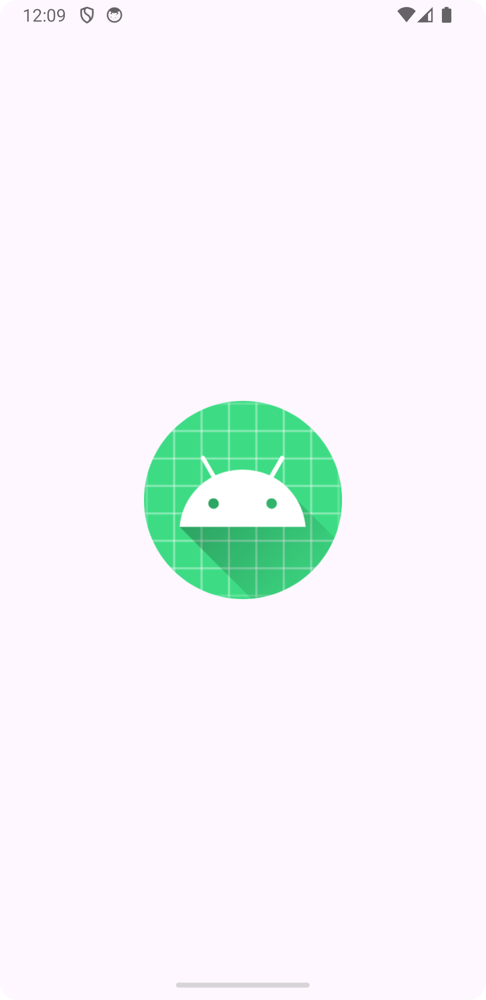

# Android Countries Application

An Android app that fetches country data from a REST API and displays it using RecyclerView.

## Installation
Clone the project - https://github.com/SowmyaChirrravuri/countries/
Open it on Android studio
Run the Project

##  App Demo
</img>

## APP Image

## App Running instructions
on launching the app, the main screen displays a list of countries automatically retrieved from a 
 API and display using a RecyclerView.

## Architecture and other technical considerations

1. Used MVVM architecture
2. Used Service Locator for dependencies 
3. Unit testing with Mockito
4. Retrofit for networking calls
5. Kotlin Coroutine
6. RecyclerView

